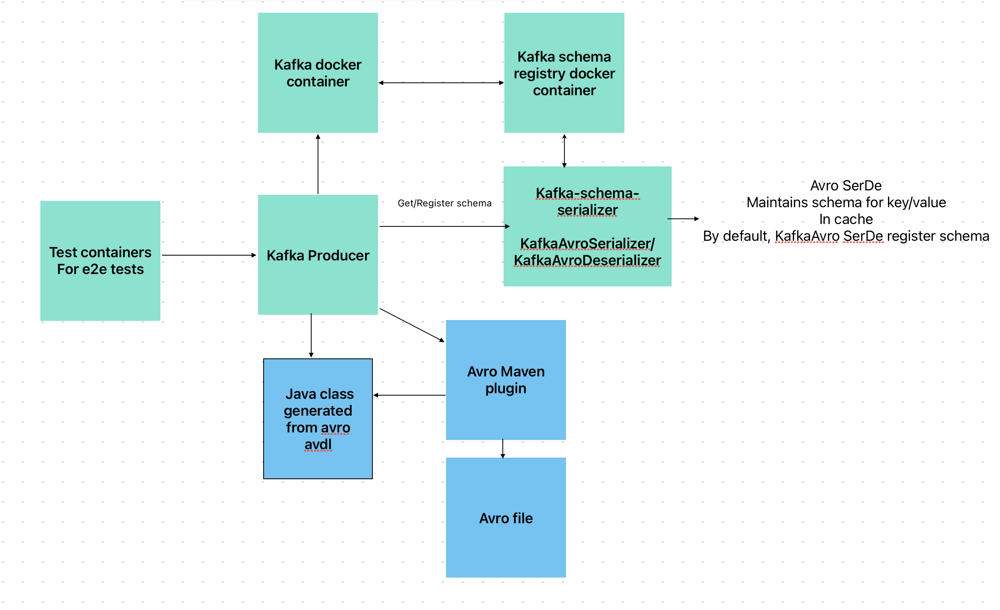

https://github.com/conduktor/kafka-stack-docker-compose
#### Start Kafka containers
```shell
docker-compose up
docker-compose down
```

nc command to verify that both the servers are listening to the respective ports:

```shell
nc -z localhost 2181
```

```shell
nc -z localhost 29092
```
```shell
nc -z localhost 8081
```
```shell
curl --silent http://localhost:8081/subjects/                      
["my-topic-avro-value","my-topic-value"]   
```
```shell
                                                                                                                                  
curl --silent http://localhost:8081/subjects/my-topic-avro-value/versions/1/schema
{"type":"record","name":"User","namespace":"com.user","fields":[{"name":"name","type":"string"},{"name":"age","type":"int"}]}
```

#### Kafka, Schema Registry, Kafka Producer and E2E Test


#### Kafka Streams API
Kafka Streams provides lightweight APIs to build stream processing applications that process data stored in Kafka using standard streaming concepts and transformation primitives. Using a simple threading model, the streams API avoids the need for back-pressure. This model works well in cases where transformations do not involve external interactions.

Reactor Kafka is useful for streams applications which process data from Kafka and use external interactions (e.g. get additional data for records from a database) for transformations. In this case, Reactor can provide end-to-end non-blocking back-pressure combined with better utilization of resources if all external interactions use the reactive model.
References:
1. For resource safety: https://arrow-kt.io/learn/quickstart/
2. For config: https://github.com/sksamuel/hoplite
3. For testing: https://kotest.io/